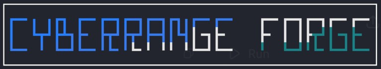

<p align="center">
  
</p>

> Generate realistic defensive cybersecurity labs in seconds.

CyberRange Forge is a cross-platform, Docker-powered cybersecurity lab generator designed for defenders, students, educators, SOC analysts, and blue teams.

Instead of downloading large virtual machines or intentionally vulnerable systems, CyberRange Forge creates lightweight, self-contained investigation labs using Docker and Jinja2 templates.

Every generated lab includes realistic artifacts, investigation exercises, documentation, Sigma detection examples, and Docker Compose files.


# Features

* Cross-platform (Linux, macOS, Windows)
* Docker-powered isolated environments
* One-command lab generation
* Modular Jinja2 template engine
* Defensive-only training scenarios
* Investigation exercises
* Sigma detection examples
* Mermaid network diagrams
* YAML lab metadata
* Export generated labs as ZIP archives
* Rich CLI with validation checks

# Included Labs

## Phishing Triage Lab

Learn to investigate suspicious emails using a simulated MailHog environment.

Generated components:

* MailHog email server
* Simulated phishing email
* Investigation guide
* Sigma detection example
* Network diagram

## Web Detection Lab

Analyze simulated web server logs for suspicious HTTP requests.

Generated components:

* Nginx web server
* Simulated access logs
* Investigation exercises
* Sigma detection rule
* Network diagram

## Linux Intrusion Lab

Investigate simulated Linux authentication events and persistence artifacts.

Generated components:

* Ubuntu analysis container
* Simulated SSH authentication logs
* Suspicious cron persistence
* Process snapshot
* Investigation exercises
* Sigma detection example

# Installation

Clone the repository:

```bash
git clone https://github.com/th3cyb3rguy/cyberrange-forge.git
cd cyberrange-forge
```

Install Python dependencies:

```bash
pip install -r requirements.txt
```

Verify your environment:

```bash
python cyberrange_forge.py validate
```

# Quick Start

List available labs:

```bash
python cyberrange_forge.py list-labs
```

Generate a lab:

```bash
python cyberrange_forge.py create phishing-triage --name demo
```

Start the lab:

```bash
cd output/demo
docker compose up -d
```

# Example Workflow

```text
Create Lab
      │
      ▼
Generate Docker Files
      │
      ▼
Start Containers
      │
      ▼
Investigate Artifacts
      │
      ▼
Practice Detection Engineering
```

# Project Structure

```text
cyberrange-forge/

├── cyberrange_forge.py
├── templates/
│   ├── phishing-triage/
│   ├── web-detection/
│   └── linux-intrusion/
│
├── output/
│
├── exports/
│
└── README.md
```

# Screenshots

The repository includes demonstrations of:

* Phishing Triage Lab
* Web Detection Lab
* Linux Intrusion Lab

Each screenshot demonstrates the full workflow from lab generation to investigation.

# Safety

CyberRange Forge is intended solely for defensive cybersecurity education.

The generated labs contain only simulated data and defensive training exercises.

No malware is deployed.

No exploitation occurs.

No vulnerable software is installed intentionally.

# AI Transparency

AI was used as an engineering assistant for:

* brainstorming ideas
* improving documentation
* reviewing code
* suggesting project architecture
* refining templates

All concept, implementation, testing, and validation were completed manually.

# License

MIT License

<hr>

## Support the Work
Everything here is free. If it's helped you, consider supporting the work. Thank you.

[](https://patreon.com/th3cyb3rguy)
